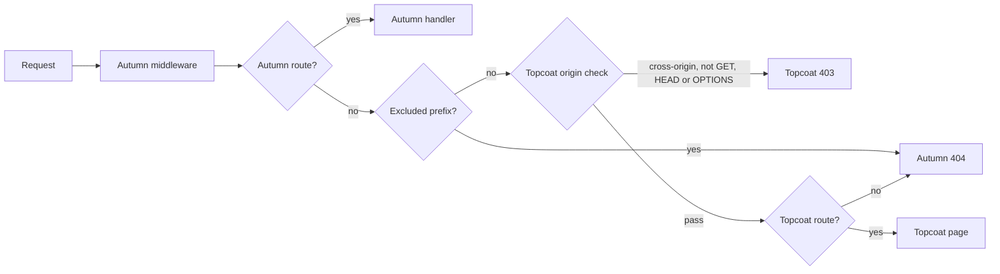

# autumn-plugin-topcoat

An [Autumn](https://github.com/autumn-foundation/autumn) plugin for [Topcoat](https://github.com/tokio-rs/topcoat). Autumn serves the backend. Topcoat renders the frontend.

The plugin mounts one Topcoat router in an Autumn app. Both frameworks use one process, one port and one middleware stack.

- Autumn keeps its typed routes, database, sessions, security headers and probes.
- Topcoat gets each path that Autumn does not route.
- Topcoat pages read Autumn data: `AppState`, the config, extensions, the session and the CSRF token.
- The plugin makes Topcoat work with Autumn CSRF, the Autumn CSP and the Autumn 404 pages.

Versions: `autumn-web` 0.7, `topcoat` 0.9, Rust 1.98 or later.

## Installation

### Manual install

Add these dependencies to `Cargo.toml`:

```toml
[dependencies]
autumn-plugin-topcoat = "0.1"
autumn-web = "0.7"
topcoat = "0.9"
```

Then register the plugin as in the [Quick start](#quick-start).

### With `autumn plugin add`

```sh
autumn plugin add autumn-plugin-topcoat
```

The command adds the `autumn-plugin-topcoat` dependency. It prints the line `.plugin(autumn_plugin_topcoat::TopcoatPlugin::new())`. Then do these steps:

1. Add `topcoat = "0.9"` to `[dependencies]`.
2. Add the printed line to your app.
3. Give the plugin a router, as in the Quick start: `TopcoatPlugin::new().router(Router::builder().page(home))`.

The printed line alone stops the startup with the error `the plugin has no Topcoat router`. `autumn plugin add` needs an Autumn CLI later than 0.7.0. With the 0.7.0 CLI, use the manual install.

### Topcoat features

Use the default Topcoat features. The plugin itself needs only the `router` feature. For a smaller feature set, a host app needs these features:

| Feature | Use |
|---------|-----|
| `router` and `view` | Pages. |
| `runtime` | Interactive pages. The runtime script is an asset, so also enable `asset`. |
| `asset` and `serve` | Serve the asset bundle from the app. Autumn owns the listener, but `AssetConfig` from an `AssetBundle` needs `serve`. Without `serve`, use `AssetConfig::hosted_at`. |
| `compression` | Streamed HTML in `autumn dev`. See [Development workflow](#development-workflow). |

## Quick start

```rust,no_run
use autumn_plugin_topcoat::{TopcoatPlugin, autumn};
use autumn_web::prelude::*;
use topcoat::context::Cx;
use topcoat::router::{Router, page};
use topcoat::view::{View, view};

// Autumn serves the backend.
#[get("/api/greeting")]
#[public]
async fn greeting() -> &'static str {
    "Hello from Autumn"
}

// Topcoat renders the frontend with data from Autumn.
#[page("/")]
async fn home(cx: &Cx) -> topcoat::Result<impl View> {
    let profile = autumn::config(cx)?.profile.clone().unwrap_or_default();
    Ok(view! { <h1>"Profile: " (profile)</h1> })
}

#[autumn_web::main]
async fn main() {
    autumn_web::app()
        .routes(routes![greeting])
        .plugin(
            TopcoatPlugin::new()
                .router(Router::builder().page(home))
                .exclude("/api"),
        )
        .run()
        .await;
}
```

Give the builder to the plugin. Do not call `build()`. The plugin builds the router at startup, when `AppState` exists.

The file `examples/host.rs` has a complete app. Run it with `cargo run --example host`. The file `examples/prefix_host.rs` mounts Topcoat under `/app`.

## How requests flow



The plugin registers typed Autumn routes with the method token `ANY`:

| Mount | Routes |
|-------|--------|
| Root (default) | `/`, `/{*path}` |
| Prefix, for example `/app` | `/app`, `/app/`, `/app/{*path}`, `/_topcoat/{*path}` |

Autumn routes, probes, `/actuator` and `/static` win over these routes. Topcoat gets the full path. The plugin never removes a prefix.

The routes are public and have the plugin as their source. Thus `autumn routes audit` stays clean. The `/openapi.json` document does not show them.

### Unknown paths

By default, Autumn answers each path that has no Topcoat route. The answer is the Autumn 404, or 204 for `GET` and `HEAD` of `/favicon.ico`. A Topcoat 404, 405 or 308 from a matched route stays unchanged.

There is one exception. The Topcoat origin check runs before route matching. So a cross-origin request to an unknown path gets a 403, not the Autumn 404. This applies to each method except `GET`, `HEAD` and `OPTIONS`, and to WebSocket handshakes. With Autumn CSRF on, Autumn CSRF can send its 403 first. Exclude each prefix that other origins call.

Autumn access logs and metrics label an unknown Topcoat path with the plugin route template, not with `_unmatched`.

## Use Autumn data in Topcoat pages

The module `autumn_plugin_topcoat::autumn` has these functions:

| Function | Result | WebSocket renders |
|----------|--------|-------------------|
| `autumn::state(cx)` | `&AppState` | Yes |
| `autumn::config(cx)` | `Arc<AutumnConfig>` | Yes |
| `autumn::extension::<T>(cx)` | `Arc<T>` from `AppState` | Yes |
| `autumn::session(cx)` | The Autumn `Session` | No: `Detached` |
| `autumn::csrf_token(cx)` | Token, header name, field name | No: `Detached` |

`csrf_token` returns `Unavailable` when Autumn CSRF is off. By default, only the prod profile turns CSRF on.

```rust,no_run
use autumn_plugin_topcoat::autumn;
use topcoat::context::Cx;
use topcoat::router::{page, route};
use topcoat::view::{View, view};

struct Catalog {
    names: Vec<String>,
}

#[page("/products")]
async fn products(cx: &Cx) -> topcoat::Result<impl View> {
    let catalog = autumn::extension::<Catalog>(cx)?;
    let csrf = autumn::csrf_token(cx).ok();
    Ok(view! {
        <ul>
            for name in &catalog.names {
                <li>(name)</li>
            }
        </ul>
        <form method="post" action="/products/add">
            if let Some(csrf) = &csrf {
                <input type="hidden" name=(csrf.field.clone()) value=(csrf.token.clone())>
            }
            <button>"Add"</button>
        </form>
    })
}

#[route(POST "/products/add")]
async fn add_product() -> topcoat::Result<&'static str> {
    Ok("added")
}
```

A Topcoat runtime render over a WebSocket has no Autumn HTTP request. In that render, the request functions return `RequestScopeError::Detached`. Put data that each render needs in `AppState`.

Write to the session before the first streamed chunk. Autumn saves the session with the response head.

Behind a reverse proxy, Topcoat `client_ip` needs `RouterBuilder::trusted_proxies`. Set it to the same networks as `security.trusted_proxies`.

## Configuration

The plugin has a builder API. It does not read a `[topcoat]` config section.

| Method | Default | Effect |
|--------|---------|--------|
| `router(builder)` | none | Sets the Topcoat router builder. |
| `router_with(closure)` | none | Makes the builder from `AppState` at startup. |
| `mount_at("/app")` | root | Mounts Topcoat under a prefix. `mount_at("/")` is the root mount. |
| `exclude("/api")` | none | Autumn answers 404 under the prefix. Topcoat does not see these requests. With a prefix mount, the prefix must be strictly under the mount. It must not be `/_topcoat` or under it. |
| `runtime_prefix("/rpc")` | none | Marks custom procedure paths for the CSRF bridge. With a prefix mount, the prefix must be under the mount or under `/_topcoat`. It must not be under an excluded prefix. |
| `csrf_bridge(mode)` | `SameOriginRuntime` | `Off` removes the CSRF bridge layer. Use `Off` when Autumn CSRF is always off: the inert layer adds a small cost to each request. |
| `csp_check(mode)` | `Warn` | `Deny` stops the startup when the CSP blocks Topcoat. `Off` skips the check. |
| `not_found(owner)` | `Autumn` | `Topcoat` keeps the Topcoat 404. |

The plugin refuses the default Autumn namespaces, for example `/static` and `/actuator`. It does not check a configured actuator prefix or configured probe paths.

The plugin reads these Autumn keys at startup:

- `security.csrf.enabled`, `security.csrf.cookie_name` and `security.csrf.token_header`
- `security.headers.content_security_policy` and `security.headers.csp_nonce.enabled`
- `idempotency.enabled`
- `role`: a process that serves no HTTP, for example a worker, does not build the router.

`TopcoatPlugin::validate` returns each configuration problem. An invalid option also stops the startup with a message for each problem.

With a valid configuration, the plugin stores a `TopcoatDiagnostics` value as an `AppState` extension. After a good startup, it writes one `info` event with the target `autumn_plugin_topcoat`. After a startup error, it writes an `error` event for each error. It writes a configuration error two times: at build time and at startup.

A startup error stops a server or a task run with a failed startup hook. `autumn build` and `autumn replay` do not run startup hooks, so they only log the error.

## Development workflow

Use `autumn dev` for the edit loop. The Topcoat runtime script is an asset, so the app needs a Topcoat asset bundle.

1. Make the bundle: `topcoat asset bundle`. This command also builds the app.
2. Start the dev loop: `autumn dev`.
3. Make the bundle again after you add, change or move an asset or an `asset!` call.

A page that renders an asset that is not in the bundle panics. If that occurs, make the bundle again.

Load the bundle in `router_with`. A missing bundle then stops the startup with the error `the Topcoat router factory failed: <I/O error>`:

```rust,no_run
use autumn_plugin_topcoat::TopcoatPlugin;
use topcoat::asset::{AssetBundle, RouterBuilderAssetExt};
use topcoat::router::module_router;
use topcoat::runtime::RouterBuilderRuntimeExt;

fn plugin() -> TopcoatPlugin {
    TopcoatPlugin::new().router_with(|_state| {
        let bundle = AssetBundle::load()?;
        Ok::<_, std::io::Error>(module_router!().runtime().assets(bundle))
    })
}
```

Keep the Topcoat `compression` feature. Do not turn compression off with `RouterBuilder::compression`. The dev reload script of Autumn then does not buffer streamed HTML.

## Production checklist

1. Set a CSP that permits the Topcoat runtime. The startup warning prints a policy that works, when the plugin can make one. For the Autumn default policy, `autumn_plugin_topcoat::csp::recommended_csp()` returns the same policy. With `security.headers.csp_nonce.enabled`, turn nonces off first.
2. Set the signing secret with `AUTUMN_SECURITY__SIGNING_SECRET` or `[security.signing_secret] secret`. The prod profile requires it. With a secret, Autumn also checks the HMAC of the CSRF cookie.
3. Exclude your API prefix, for example `exclude("/api")`. API clients then get 404 responses in the Problem Details format.
4. Do not use a root capture route, for example `#[get("/{slug}")]`, with the root mount. Use `mount_at` instead.
5. Deploy the `assets` directory from the same build next to the binary, or load it with `AssetBundle::load_dir`.
6. With locale routing in Autumn i18n, exclude the plugin templates:
   - Root mount: `[i18n] locale_prefix_exclude = ["/", "/{*path}"]`
   - Prefix mount `/app`: `[i18n] locale_prefix_exclude = ["/app", "/_topcoat"]`
7. With idempotency on, read the startup warning. The CSRF bridge layer makes idempotent replay fail closed.

## Security model

Autumn CSRF uses a double-submit token. The Topcoat runtime sends JSON `POST` requests without that token. The CSRF bridge copies the CSRF cookie into the CSRF header when all these rules are true:

| Rule | Check |
|------|-------|
| 1 | The method is `POST`. |
| 2 | The axum `MatchedPath` is a plugin route template. A host route on the same template, for example `POST /` with the root mount, also matches. |
| 3 | The path is not under an excluded prefix. |
| 4 | The request has no CSRF header. |
| 5 | The media type is `application/json`. |
| 6 | The request has `x-topcoat-runtime: true`, an `x-topcoat-identity` header, or a canonical path under `/_topcoat/runtime/` or a runtime prefix. |
| 7 | `Sec-Fetch-Site` is `same-origin`. See the `Origin` fallback below. |
| 8 | The request has exactly one CSRF cookie. Its value is not empty and is a valid header value. |

Without `Sec-Fetch-Site`, rule 7 uses the `Origin` fallback:

- The request has one `Origin` and at most one `Host`.
- The host and port of `Origin` are equal to the expected host and port.
- The expected authority is the client host that Autumn resolves, else `Host`, else the URI authority.
- The bridge compares the scheme only when Autumn resolves it, for example from a trusted `X-Forwarded-Proto`. A scheme value that does not parse fails the rule.

If one rule is false, the bridge does not change the request. Autumn CSRF then makes the decision.

The browser sets `Sec-Fetch-Site` and `Origin`. Scripts on other sites cannot change them. A JSON body from another origin needs a CORS preflight. Thus the bridge does not help a cross-site attack.

The plugin handler removes the copied header before Topcoat gets the request. The Topcoat origin check stays active for plugin routes. A host handler on a shared template gets the copied header, and the Topcoat origin check does not run for it.

## Limitations

- One Topcoat router for each app. Autumn skips a second registration.
- Topcoat cannot answer other methods on a path that an Autumn route owns. Autumn answers 405.
- The Topcoat dev server (`topcoat dev`) does not work with this plugin. Use `autumn dev`.
- Topcoat 0.9 has no CSP nonce support, so the runtime needs `'unsafe-inline'`. The runtime compiles expressions with `new Function`, so it also needs `'unsafe-eval'`.

## Status

Version 0.1. The API can change before 1.0. The design record is `docs/adr/0001-mount-topcoat-with-typed-routes.md`.

## License

Apache-2.0. See `LICENSE`.
