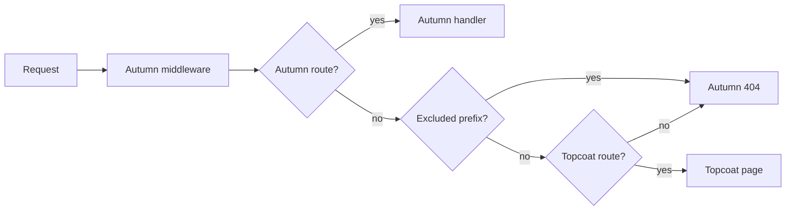

# autumn-plugin-topcoat

An [Autumn](https://github.com/autumn-foundation/autumn) plugin for [Topcoat](https://github.com/tokio-rs/topcoat). Autumn serves the backend. Topcoat renders the frontend.

The plugin mounts one Topcoat router in an Autumn app. Both frameworks use one process, one port and one middleware stack.

- Autumn keeps its typed routes, database, sessions, security headers and probes.
- Topcoat gets each path that Autumn does not route.
- Topcoat pages read Autumn data: `AppState`, the config, extensions, the session and the CSRF token.
- The plugin makes Topcoat work with Autumn CSRF, the Autumn CSP and the Autumn 404 pages.

Versions: `autumn-web` 0.7, `topcoat` 0.9, Rust 1.98 or later.

## Installation

### With `autumn plugin add`

```sh
autumn plugin add autumn-plugin-topcoat
```

The command prints the `.plugin(...)` line. Add that line to your app.

### Manual install

Add these dependencies to `Cargo.toml`:

```toml
[dependencies]
autumn-plugin-topcoat = "0.1"
autumn-web = "0.7"
topcoat = "0.9"
```

## Quick start

```rust,no_run
use autumn_plugin_topcoat::{TopcoatPlugin, autumn};
use autumn_web::prelude::*;
use topcoat::context::Cx;
use topcoat::router::{Router, page};
use topcoat::view::{View, view};

// Autumn serves the backend.
#[get("/api/greeting")]
#[public]
async fn greeting() -> &'static str {
    "Hello from Autumn"
}

// Topcoat renders the frontend with data from Autumn.
#[page("/")]
async fn home(cx: &Cx) -> topcoat::Result<impl View> {
    let profile = autumn::config(cx)?.profile.clone().unwrap_or_default();
    Ok(view! { <h1>"Profile: " (profile)</h1> })
}

#[autumn_web::main]
async fn main() {
    autumn_web::app()
        .routes(routes![greeting])
        .plugin(
            TopcoatPlugin::new()
                .router(Router::builder().page(home))
                .exclude("/api"),
        )
        .run()
        .await;
}
```

Give the builder to the plugin. Do not call `build()`. The plugin builds the router at startup, when `AppState` exists.

The file `examples/host.rs` has a complete app. Run it with `cargo run --example host`.

## How requests flow



The plugin registers typed Autumn routes with the method token `ANY`:

| Mount | Routes |
|-------|--------|
| Root (default) | `/`, `/{*path}` |
| Prefix, for example `/app` | `/app`, `/app/`, `/app/{*path}`, `/_topcoat/{*path}` |

Autumn routes, probes, `/actuator` and `/static` win over these routes. Topcoat gets the full path. The plugin never removes a prefix.

The routes are public and have the plugin as their source. Thus `autumn routes audit` stays clean.

## Use Autumn data in Topcoat pages

The module `autumn_plugin_topcoat::autumn` has these functions:

| Function | Result | WebSocket renders |
|----------|--------|-------------------|
| `autumn::state(cx)` | `&AppState` | Yes |
| `autumn::config(cx)` | `Arc<AutumnConfig>` | Yes |
| `autumn::extension::<T>(cx)` | `Arc<T>` from `AppState` | Yes |
| `autumn::session(cx)` | The Autumn `Session` | No: `Detached` |
| `autumn::csrf_token(cx)` | Token, header name, field name | No: `Detached` |

```rust,no_run
use autumn_plugin_topcoat::autumn;
use topcoat::context::Cx;
use topcoat::router::page;
use topcoat::view::{View, view};

struct Catalog {
    names: Vec<String>,
}

#[page("/products")]
async fn products(cx: &Cx) -> topcoat::Result<impl View> {
    let catalog = autumn::extension::<Catalog>(cx)?;
    let csrf = autumn::csrf_token(cx)?;
    Ok(view! {
        <ul>
            for name in &catalog.names {
                <li>(name)</li>
            }
        </ul>
        <form method="post" action="/products">
            <input type="hidden" name=(csrf.field) value=(csrf.token)>
            <button>"Add"</button>
        </form>
    })
}
```

A Topcoat runtime render over a WebSocket has no Autumn HTTP request. In that render, the request functions return `RequestScopeError::Detached`. Put data that each render needs in `AppState`.

Write to the session before the first streamed chunk. Autumn saves the session with the response head.

## Configuration

The plugin has a builder API. It does not read a `[topcoat]` config section.

| Method | Default | Effect |
|--------|---------|--------|
| `router(builder)` | none | Sets the Topcoat router builder. |
| `router_with(closure)` | none | Makes the builder from `AppState` at startup. |
| `mount_at("/app")` | root | Mounts Topcoat under a prefix. |
| `exclude("/api")` | none | Autumn answers 404 under the prefix. Topcoat does not see these requests. |
| `runtime_prefix("/rpc")` | none | Marks custom procedure paths for the CSRF bridge. |
| `csrf_bridge(mode)` | `SameOriginRuntime` | `Off` removes the CSRF bridge. |
| `csp_check(mode)` | `Warn` | `Deny` stops the startup when the CSP blocks Topcoat. `Off` skips the check. |
| `not_found(owner)` | `Autumn` | `Topcoat` keeps the Topcoat 404. |

The plugin reads these Autumn keys at startup:

- `security.csrf.enabled`, `security.csrf.cookie_name` and `security.csrf.token_header`
- `security.headers.content_security_policy` and `security.headers.csp_nonce.enabled`
- `idempotency.enabled`

An invalid option stops the startup with a message for each problem.

At startup, the plugin writes one `info` event with the target `autumn_plugin_topcoat`. It also stores a `TopcoatDiagnostics` value as an `AppState` extension.

## Development workflow

Use `autumn dev` for the edit loop. The Topcoat runtime script is an asset, so the app needs a Topcoat asset bundle.

1. Build the app: `cargo build`.
2. Make the bundle: `topcoat asset bundle`.
3. Start the dev loop: `autumn dev`.
4. Make the bundle again after you change an asset.

Load the bundle in `router_with`. A missing bundle then stops the startup with a clear error:

```rust,no_run
use autumn_plugin_topcoat::TopcoatPlugin;
use topcoat::asset::{AssetBundle, RouterBuilderAssetExt};
use topcoat::router::module_router;
use topcoat::runtime::RouterBuilderRuntimeExt;

fn plugin() -> TopcoatPlugin {
    TopcoatPlugin::new().router_with(|_state| {
        let bundle = AssetBundle::load()?;
        Ok::<_, std::io::Error>(module_router!().runtime().assets(bundle))
    })
}
```

Keep Topcoat compression on (the default). The Autumn dev reload script then does not buffer streamed HTML.

## Production checklist

1. Set a CSP that permits the Topcoat runtime. The startup warning prints a policy that works. `autumn_plugin_topcoat::csp::recommended_csp()` returns the same policy.
2. Set a CSRF signing secret (`security.signing_secret`). Then Autumn also checks the HMAC of the CSRF cookie.
3. Exclude your API prefix, for example `exclude("/api")`. API clients then get Problem Details 404 responses.
4. Do not use a root capture route, for example `#[get("/{slug}")]`, with the root mount. Use `mount_at` instead.
5. Deploy the Topcoat asset bundle next to the binary, or load it with `AssetBundle::load_dir`.
6. With Autumn i18n locale routing, add the plugin routes to `locale_prefix_exclude`.
7. With idempotency on, read the startup warning. The CSRF bridge layer makes idempotent replay fail closed.

## Security model

Autumn CSRF uses a double-submit token. The Topcoat runtime sends JSON `POST` requests without that token. The CSRF bridge copies the CSRF cookie into the CSRF header when all these rules are true:

| Rule | Check |
|------|-------|
| 1 | The method is `POST`. |
| 2 | axum matched a plugin route. |
| 3 | The path is not under an excluded prefix. |
| 4 | The request has no CSRF header. |
| 5 | The media type is `application/json`. |
| 6 | The request has `x-topcoat-runtime: true`, an `x-topcoat-identity` header, or a canonical path under `/_topcoat/runtime/` or a runtime prefix. |
| 7 | `Sec-Fetch-Site` is `same-origin`. If that header is absent, `Origin` is equal to the server origin. |
| 8 | The request has exactly one CSRF cookie. |

If one rule is false, the bridge does not change the request. Autumn CSRF then makes the decision.

The browser sets `Sec-Fetch-Site` and `Origin`. Scripts on other sites cannot change them. A JSON body from another origin needs a CORS preflight. Thus the bridge does not help a cross-site attack. The handler removes the copied header before Topcoat gets the request.

The Topcoat origin check stays active behind the bridge.

## Limitations

- One Topcoat router for each app. A second registration is skipped.
- Topcoat cannot answer other methods on a path that an Autumn route owns. Autumn answers 405.
- The Topcoat dev server (`topcoat dev`) does not work with this plugin. Use `autumn dev`.
- Topcoat 0.9 has no CSP nonce support, so the runtime needs `'unsafe-inline'` and `'unsafe-eval'`.

## Status

Version 0.1. The API can change before 1.0. The design record is `docs/adr/0001-mount-topcoat-with-typed-routes.md`.

## License

Apache-2.0. See `LICENSE`.
