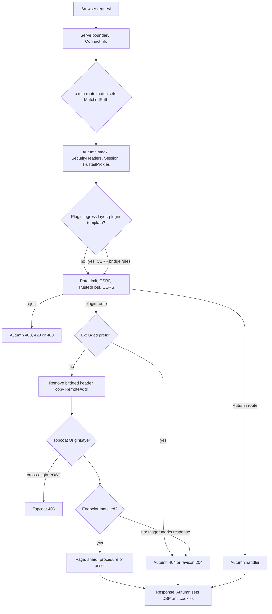

# ADR 0001: Mount Topcoat in Autumn with typed routes and security bridges

- Status: Accepted
- Date: 2026-09-27
- Scope: crate `autumn-plugin-topcoat` 0.1
- Targets: `autumn-web` 0.7.x (axum 0.8.9, matchit 0.8.4), `topcoat` 0.9, Rust 1.98.1

## Context

Autumn is the backend. Topcoat renders the frontend. The plugin puts the two in one process, on one port, behind one middleware stack.

Autumn calls `Plugin::build` before it loads the config. `AppState` does not exist at that time. A state initializer gets `&AppState` before Autumn builds the router.

`AppBuilder::merge` hides routes from Autumn. The command `autumn routes audit` fails for each merged router. The duplicate-route preflight cannot check merged routers, so a route conflict causes a panic.

Autumn sets its 404 fallback after it merges the plugin routers. A fallback from a plugin does not stay.

Topcoat needs the full request path. Topcoat writes absolute URLs for links, assets, shards and procedures.

The Topcoat runtime can render over a WebSocket with a synthetic request. That request keeps the URI, the handshake headers and `RemoteAddr`. It loses all Autumn request extensions. The Topcoat app context stays.

The prod profile turns on Autumn CSRF. The Topcoat runtime sends JSON `POST` requests without a CSRF token. Autumn rejects each of them with 403. Exempt paths are prefixes only, and page reruns go to any page URL.

The Autumn default CSP has `script-src 'self'`. The runtime compiles expressions with `new Function`, so it needs `'unsafe-eval'`. Streamed HTML swaps are inline scripts, so they need `'unsafe-inline'`. Autumn replaces a CSP that a response sets.

A root catch-all receives each unmatched path. Without a fix, API clients get the Topcoat text 404 and not the Autumn Problem Details.

## Decision

### 1. Mount

The plugin registers typed `autumn_web::Route` values with `AppBuilder::routes`. Each route has the method token `ANY` and the handler `axum::routing::any`. Each route is public, hidden from OpenAPI and excluded from MCP. The plugin does not call `merge`, `nest` or `fallback`.

The default mount is the root, and `mount_at("/")` is the root too. It registers `/` and `/{*path}`. A prefix mount, for example `/app`, registers `/app`, `/app/`, `/app/{*path}` and `/_topcoat/{*path}`. The plugin never removes the prefix. The user declares the pages under the prefix.

A prefix has segments of ASCII letters, digits, `-`, `.`, `_` and `~` only. The plugin refuses the default Autumn namespaces, for example `/static` and `/actuator`. It does not check a configured actuator prefix or configured probe paths.

### 2. Router input

The user gives a Topcoat `RouterBuilder`. As an alternative, the user gives a closure that makes the builder from `AppState`. The plugin builds the router in a state initializer. At that time, the plugin adds `AppState` to the Topcoat app context. It also adds a pathless layer that marks unmatched requests. A panic in the closure or in `build()` becomes a startup error.

### 3. State bridge

A page calls `autumn::state(cx)`, `autumn::extension::<T>(cx)` or `autumn::config(cx)` for backend access. These functions read the app context. They work in HTTP renders and in WebSocket renders.

A page calls `autumn::csrf_token(cx)` or `autumn::session(cx)` for request data. In a WebSocket render, these functions return `RequestScopeError::Detached`. The plugin never puts request data in the app context.

### 4. CSRF bridge

The plugin adds one Tower layer. The layer runs after `TrustedProxies` and before the rate limiter and CSRF. The bridge is on by default. When CSRF is off, the layer changes no request. It stays in the stack and adds a small cost to each request. `CsrfBridge::Off` removes the layer.

The layer acts only when Autumn CSRF is on. It reads the cookie name and the header name from the Autumn config at startup. It copies the CSRF cookie value into the CSRF header only when all these rules are true:

1. The method is `POST`.
2. The axum `MatchedPath` is one of the plugin templates.
3. The path is not under an excluded prefix.
4. The request has no CSRF header.
5. The media type is `application/json`.
6. The request has a runtime marker: `x-topcoat-runtime: true`, an `x-topcoat-identity` header, or a canonical path under `/_topcoat/runtime/` or under a runtime prefix.
7. The request is same-origin. `Sec-Fetch-Site` is `same-origin`. If that header is absent, the `Origin` fallback applies:
   - The request has one `Origin` and at most one `Host`.
   - The host and port of `Origin` are equal to the expected host and port. The expected authority is the client host that Autumn resolves, else `Host`, else the URI authority.
   - The bridge compares the scheme only when Autumn resolves it, for example from a trusted `X-Forwarded-Proto`. A scheme value that does not parse fails the rule.
8. The request has exactly one CSRF cookie. Its value is not empty and is a valid header value.

If one rule is false, the layer does not change the request. Autumn CSRF then makes the decision.

The handler removes the copied header before Topcoat gets the request. Thus Topcoat never sees a CSRF header that the client did not send (AC-13). This is hygiene, not secrecy: page code still gets the `Cookie` header, and `autumn::csrf_token` returns the token by design.

### 5. CSP

At startup, the plugin analyzes the effective CSP, including `sandbox`. In the default mode, the plugin writes one warning for each problem. The warning gives a policy that fixes it, when the plugin can make one. For the Autumn default policy, that policy is `recommended_csp`. With nonces on, the warning tells the user to remove the nonce sources. In the `Deny` mode, the plugin stops the startup. The plugin never changes the config. A process that serves no HTTP skips the check: a worker role, or a one-off task run (`AUTUMN_RUN_TASK`).

### 6. 404 and excluded prefixes

If Topcoat has no route for a path, the plugin returns the Autumn 404. `GET` and `HEAD` for `/favicon.ico` return 204, as in Autumn. The user can exclude prefixes, for example `/api`. Topcoat does not see requests under an excluded prefix. The option `NotFoundOwner::Topcoat` keeps the Topcoat 404.

There is one exception. The Topcoat `OriginLayer` runs before endpoint matching. So a cross-origin request that is not safe gets the Topcoat 403 for an unknown path. The user excludes each prefix that other origins call.

### 7. Client address

The handler copies `ConnectInfo<SocketAddr>` into the Topcoat `RemoteAddr`. The value is the TCP peer. The handler skips port 0, because Autumn uses that synthetic address for Unix sockets.

### 8. Configuration and errors

The plugin has a builder API only. It does not claim a `[topcoat]` config section.

`Plugin::build` cannot return an error. The plugin keeps each error and logs it. A startup hook returns all errors, so Autumn stops a server or a task run with exit code 1. `autumn build` and `autumn replay` do not run startup hooks. For these modes, a state initializer logs a configuration error again, after telemetry starts. A process that serves no HTTP does not build the router. A worker role and a one-off task run serve no HTTP. A task run keeps the `Combined` role, so the plugin reads `AUTUMN_RUN_TASK`, as Autumn does. Before the router is ready, the handler returns 503. After a failed startup, the handler returns 500. Production code does not use `unwrap` or `expect`.

## Request flow

## Security of the CSRF bridge

Double-submit proves one fact: a page of the same origin sent the request. The bridge proves the same fact with evidence from the browser. The browser sets `Sec-Fetch-Site` and `Origin`. Page scripts cannot set these headers. A JSON body causes a CORS preflight for a sender from a different origin.

The CSRF cookie is `SameSite=Lax`. A cross-site `POST` does not send it. The bridge refuses two cookies with the same name. Autumn still compares the values in constant time. With a signing secret, Autumn also checks the HMAC. Thus the security rests on rule 7 (same origin) and rule 5 (JSON).

The bridge acts only on plugin route templates. If `MatchedPath` is missing, the bridge does nothing. An Autumn route that shares a plugin template, for example a host `POST /`, can get a copied header. Rule 7 (same origin) still applies to it. The host handler keeps the header, and the Topcoat `OriginLayer` does not run for it.

The rules are stricter than the Topcoat `OriginLayer`. That layer accepts `Sec-Fetch-Site: none` and requests without `Origin`. The Topcoat `OriginLayer` still runs after Autumn.

A script from the same origin can still send a request. The token method has the same limit, because such a script can read the token.

## Consequences

### Good results

- `autumn routes audit` stays clean. Route conflicts become typed errors.
- Interactive Topcoat pages work in the prod profile with CSRF on.
- Pages get the `AppState`, the config and the extensions in all renders.
- API clients get the Autumn 404. Operators see CSP problems at startup.

### Bad results

- A host with a root capture route, for example `/{slug}`, must use a prefix mount.
- The recommended CSP adds `'unsafe-eval'` and `'unsafe-inline'`. This decreases XSS protection for the full app.
- The ingress layer makes idempotent replay fail closed when idempotency is on. The plugin writes a warning in that case.
- When Autumn CSRF is off, the inert ingress layer still adds a small cost to each request. `CsrfBridge::Off` removes it.
- The plugin copies private Autumn behavior: the 404 text, the favicon path, the CSP resolution and the cookie parser. Tests compare these copies with Autumn.

### Risks

- Locale routing in Autumn i18n can nest the plugin routes. The user must exclude the plugin templates: `["/", "/{*path}"]` for the root mount, `["/app", "/_topcoat"]` for the prefix mount `/app`.
- A new field in `autumn_web::Route` stops compilation. The crate pins `autumn-web` to `>=0.7, <0.8`.
- Session writes after the first streamed chunk do not persist, because Autumn saves the session with the response head.

## Rejected alternatives

- `merge` mount: it fails the audit and skips the preflight.
- `fallback_service`: Autumn replaces it.
- Built `Router` input: it has no app context, so WebSocket renders lose state and unmatched paths lose their marker.
- `exempt_paths`: prefixes only. The value `/` turns off CSRF for the full app.
- JavaScript fetch shim: it needs an extra script, changes runtime internals and misses WebSocket markup.
- Rate-limit exemption for assets: it opens a denial-of-service path.
- `[topcoat]` TOML section: it needs a second config resolver.

## Acceptance criteria

| ID | Criterion |
|----|-----------|
| AC-1 | `TopcoatPlugin::new()` is equal to `Default`. `name()` is `autumn-plugin-topcoat`. The defaults are: root mount, CSRF bridge on, CSP check `Warn`, Autumn owns 404. |
| AC-2 | The root mount registers typed `ANY` routes `/` and `/{*path}`. A prefix mount `/app` registers `/app`, `/app/`, `/app/{*path}` and `/_topcoat/{*path}`. Each route is public, hidden and attributed to the plugin. The plugin never calls `merge`, `nest` or `fallback`. |
| AC-3 | Topcoat gets the exact path and query for `GET` and `POST` through the full Autumn stack. |
| AC-4 | Framework routes and host routes win over the catch-all. A host `#[get("/")]` and the plugin share `/`. |
| AC-5 | A host `/{slug}` route and the root mount give the typed Autumn error `ConflictingRouteShape`. A prefix mount removes the conflict. |
| AC-6 | `MountPath` and `PathPrefix` never panic, refuse each invalid input with the correct error and accept each valid input. `covers` agrees with matchit 0.8.4. axum accepts the templates of each valid prefix. |
| AC-7 | An invalid configuration registers no routes and no layers. The startup fails and names each problem. |
| AC-8 | A panic or an error in the router closure or in `build()` becomes a typed startup error. The handler returns 503 before the router is ready and 500 after a failed startup. |
| AC-9 | `autumn::state`, `autumn::config` and `autumn::extension` work in HTTP renders and in detached renders. They return typed errors when the plugin does not serve the page. |
| AC-10 | `autumn::csrf_token` and `autumn::session` work in HTTP renders. They return `Detached` in detached renders. Session writes persist. |
| AC-11 | With CSRF on, the bridge admits same-origin runtime requests: page reruns, shards, default procedures, runtime-prefix procedures and the `Origin` fallback. Custom cookie and header names and a signing secret work. |
| AC-12 | With CSRF on, Autumn CSRF returns 403 for each hostile case. The cases include other-site fetch metadata, a bad `Origin`, no origin evidence and bad cookies. They also include non-JSON bodies, no runtime marker, Autumn-owned routes, excluded paths and dot segments. The bridge never replaces a client header. |
| AC-13 | Topcoat never sees the copied header. With CSRF off, the layer does not change requests. `CsrfBridge::Off` registers no layer. The Topcoat `OriginPolicy` stays active. |
| AC-14 | The bridge decision agrees with an independent model and is monotone under hostile changes. The cookie parser agrees with the Autumn parser. |
| AC-15 | The CSP analysis runs at startup, writes warnings with a fix and supports `Deny` and `Off`. `recommended_csp` passes the analysis. The analysis of the effective policy agrees with the analysis of the real header. |
| AC-16 | By default, an unmatched path returns the Autumn 404 and `/favicon.ico` returns 204. A page 404, a 405 and a 308 from Topcoat do not change. `NotFoundOwner::Topcoat` keeps the Topcoat 404. Excluded prefixes return the Autumn 404 without a Topcoat call. A cross-origin request that is not safe gets the Topcoat 403 for an unknown path. |
| AC-17 | Topcoat `remote_addr` is the TCP peer when `ConnectInfo` is present, and `None` when it is absent. |
| AC-18 | A streamed response sends its first chunk before the stream ends. A WebSocket upgrade through the full Autumn stack returns 101. With two compressors, a response has one `Content-Encoding`. |
| AC-19 | With a valid configuration, the startup stores `TopcoatDiagnostics`. It writes one info event after a good startup, and an error event for each startup error. It writes a configuration error at build time and again at startup. The plugin writes a warning when idempotency becomes fail-closed. |
| AC-20 | Autumn skips a second registration of the plugin without a panic. The plugin claims no config section. |
| AC-21 | README, ADR, CHANGELOG, CLAUDE.md and rustdoc exist and use ASD-STE100 style. README snippets compile as doctests. An example host binary exists. |
| AC-22 | fmt, clippy (pedantic and nursery, `-D warnings`), tests on 1.98.1 and line coverage of production code of 90% or more pass. Production code has no `unwrap`, `expect`, `panic` or `unsafe`. CI runs these checks and the route audit. |
| AC-23 | Guard tests pin the axum behavior that the design uses. |

## Verification

TestApp tests run the full production middleware stack, with the autumn-web features `maud`, `htmx`, `flash`, `reporting` and `openapi`. A real-socket test checks the WebSocket upgrade. A weekly CI job runs the tests with the newest compatible dependency versions. Property tests check the pure cores: mount paths, prefixes, origins, the bridge decision, the cookie parser and the CSP analyzer. Verus is not available in the build environment, so each pure core has a `# Contract` section and property tests instead of proofs.
